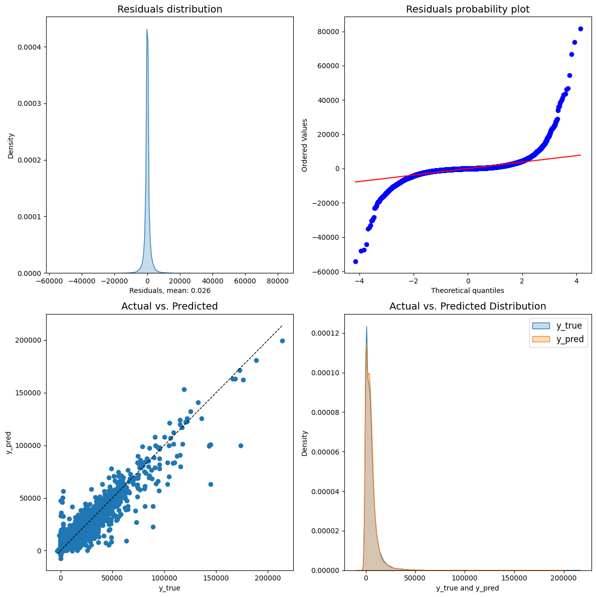

### Добро пожаловать! Решение команды хромосомный надзор

🚀 Наша команда приняла вызов хакатона и разработала инновационный прототип сервиса для прогнозирования взносов участников НПО, используя современные технологии машинного обучения. Наше решение не только предсказывает выручку компании с высокой точностью, но и раскрывает ключевые экономические факторы, влияющие на пенсионные накопления. Мы провели глубокий анализ данных и выделили основные параметры, определяющие финансовое поведение клиентов. С учетом их инвестиционных стратегий, мы успешно таргетировали клиентов и предложили уникальные механизмы стимулирования инвестиций. Благодаря использованию градиентного бустинга и передовых методов прогнозирования, наш подход объединяет интерпретируемость данных и непревзойденную точность прогнозов, что делает его ценным для государства и бизнеса. 💡📈

Решение расположено в трех файлах

1. Файл "app.py"

в нем находится скрипт который запускает модель и разворачивает сайт, где можно ввести предикторы и предсказать какую сумму внесет клиент в следующем квартале. 

Для запуска необходим интерпретатор python и стандартные библиотеки Flask, CatBoostRegressor, shap

2. Файл "Model 1.ipynb". в ней произведен анализ исходного датасета, произведена предобработка данных, построена модель предсказания взноса конкретного клиента. 
Внимание: npo_trnsctns.csv - большой файл и Git не дает его разместить, для запуска надо его отдельно считать с вашего носителя
Используются старндартные библиотеки: 
pandas 
matplotlib.pyplot as plt
numpy 
shap
sklearn
сatboost import cv

3. Файл "Model 2.ipynb".  построена модель предсказания поступлений за год для всей компании. 
Внимание: npo_trnsctns.csv - большой файл и Git не дает его разместить, для запуска надо его отдельно считать с вашего носителя
Используются старндартные библиотеки: 
pandas 
matplotlib.pyplot as plt
numpy 
shap
sklearn
сatboost import cv

